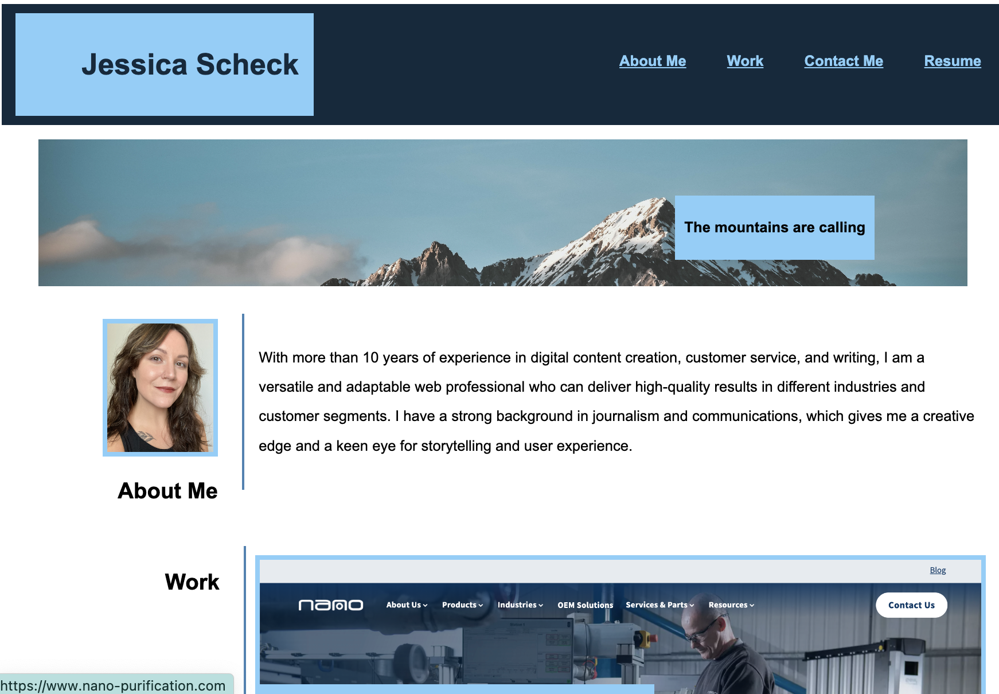

# My Portfolio

## User Story

```
AS AN employer
I WANT to view a potential employee's deployed portfolio of work samples
SO THAT I can review samples of their work and assess whether they're a good candidate for an open position
```

## Steps to Creation

I first looked at the example image for a layout, and then plotted whether or not I wanted to utilize flex boxes, or an aside, and I messed with that layout process for a few hours.
I settled on flex boxes so the items would line up together
Then I kept finicking with the structure to simplify the design code and make it more stranger-friendly; also wanted to understand how to stack flex boxes to create a layout
I've considered using flex: grid, but we didn't over that in class, and I wanted to get to know how flex box worked better

## Portfolio Location

You can find my portfolio here: https://jessmica11.github.io/portfolio/


## Acceptance Criteria:

Here are the critical requirements necessary to develop a portfolio that satisfies a typical hiring manager’s needs:

```
GIVEN I need to sample a potential employee's previous work
WHEN I load their portfolio
THEN I am presented with the developer's name, a recent photo or avatar, and links to sections about them, their work, and how to contact them
WHEN I click one of the links in the navigation
THEN the UI scrolls to the corresponding section
WHEN I click on the link to the section about their work
THEN the UI scrolls to a section with titled images of the developer's applications
WHEN I am presented with the developer's first application
THEN that application's image should be larger in size than the others
WHEN I click on the images of the applications
THEN I am taken to that deployed application
WHEN I resize the page or view the site on various screens and devices
THEN I am presented with a responsive layout that adapts to my viewport
```

© 2023 edX Boot Camps LLC. Confidential and Proprietary. All Rights Reserved.
